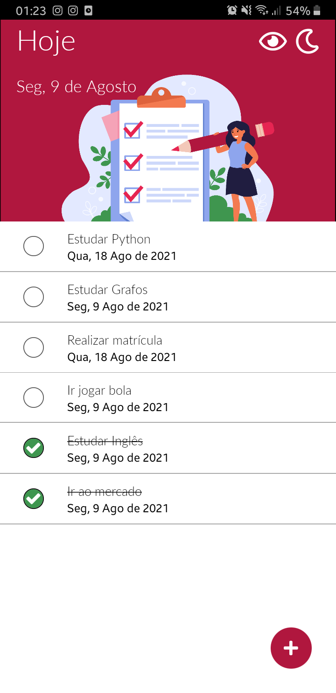

# React Native
Alguns projetos simples que aprendi no curso [React Native: Desenvolva APPs Nativas para Android e iOS ](https://www.udemy.com/course/curso-react-native/)

# Telas

  
  
  
   
  
  

