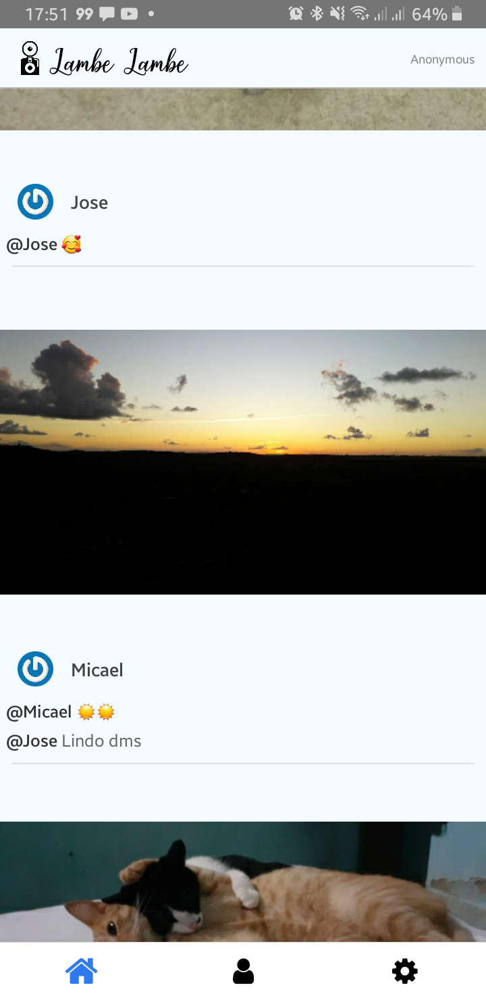
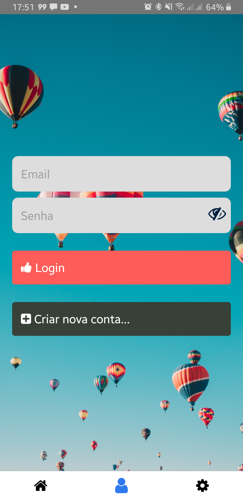
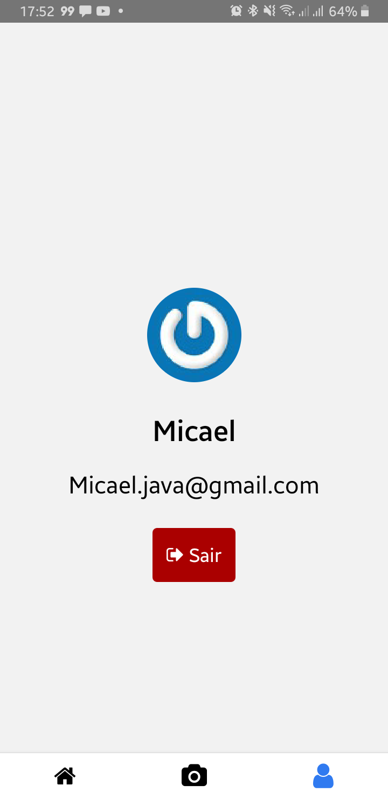
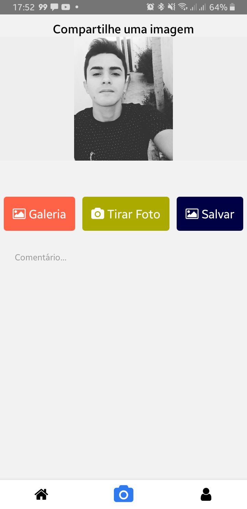

# Clone simples do Instagram
Aqui aprendi várias coisas legais tais como:
- Utilizar algumas funcionalidades gratuitas do Firebase como o sistema de autenticação.
- Vincular o App com a câmera do dispositivo.
- Gerenciar estado com Redux.
- E vários componentes do React.

# Telas

   
   
  
  

