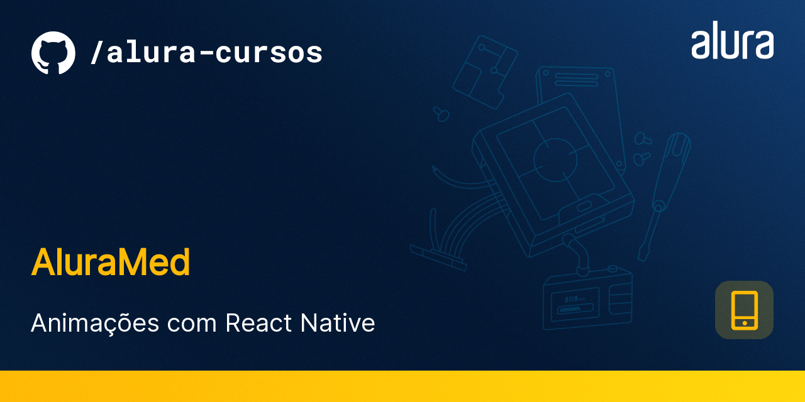

<h1 align="center">
    
</h1>

<!-- https://alura-github-thumbnail-generator.vercel.app/ -->

<h4 align="center"> 
	AluraMed (Adapatado para não usar o Expo)
</h4>

<p align="center">
  <a href="#information_source-o-que-é-o-aluramed">O que é o AluraMed?</a>&nbsp;&nbsp;&nbsp;|&nbsp;&nbsp;&nbsp;
  <a href="#rocket-Tecnologias">Tecnologias</a>&nbsp;&nbsp;&nbsp;|&nbsp;&nbsp;&nbsp;
  <a href="#information_source-como-usar">Como usar</a>&nbsp;&nbsp;&nbsp;|&nbsp;&nbsp;&nbsp;
</p>

## :information_source: O que é o AluraMed?

O AluraMed é uma aplicação feita em React Native que simula um aplicativo de consultas médicas. A ideia é usar animações nesse projeto para tornar a aplicação mais agradável e intuitiva.

Esse projeto é utilizado na formação base de React Native da plataforma da Alura.


<h1 align="center">
    
</h1>


## :rocket: Tecnologias

Esse projeto foi desenvolvido com a utilização das seguintes tecnologias:
- [React Native][rn]

## :information_source: Como usar

Para copiar e executar essa aplicação, você precisa de três pré-requisitos: [Git](https://git-scm.com), [Node.js][nodejs] + [Yarn][yarn] intalados no seu computador.

No terminal, digite os comandos a seguir:

### Executar o Mobile

```bash
$ yarn # instala dependencias
$ yarn android # build para android
$ yarn start # inicia o projeto
```