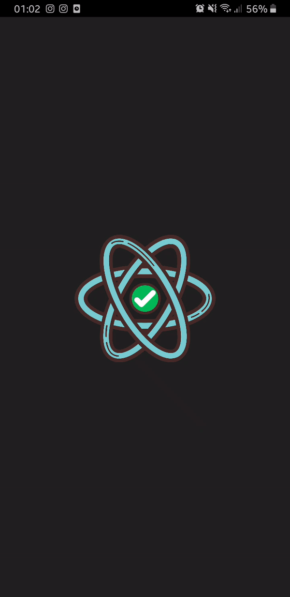
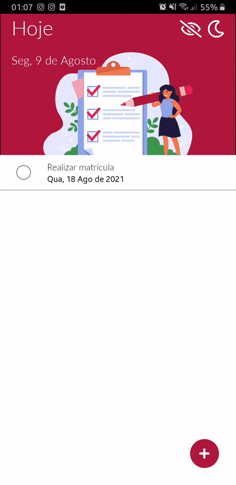
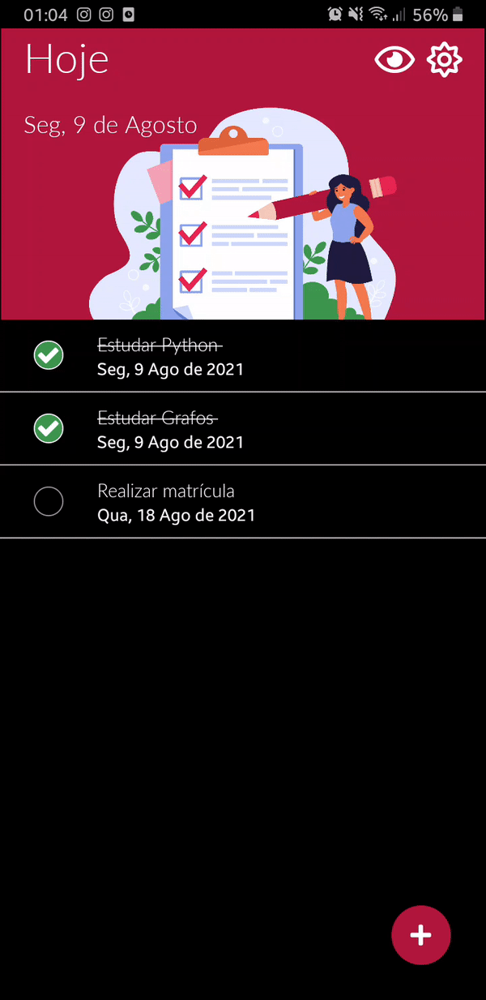

# Task List
Aqui aprendi usar alguns componentes interessantes como o `Swipeable`, `Modal` e `DateTimePicker`. Além disso, também aprendi a armazenar dados permanente com o `AsyncStorage`.

# Telas

  
   
   
   

# Referências

- [Freepik 📷](https://br.freepik.com/vetores-gratis/lista-de-verificacao-ou-conceito-de-pesquisa_9649176.htm#page=1&query=task&position=17)
- [Icon 📷](https://iconscout.com/)
